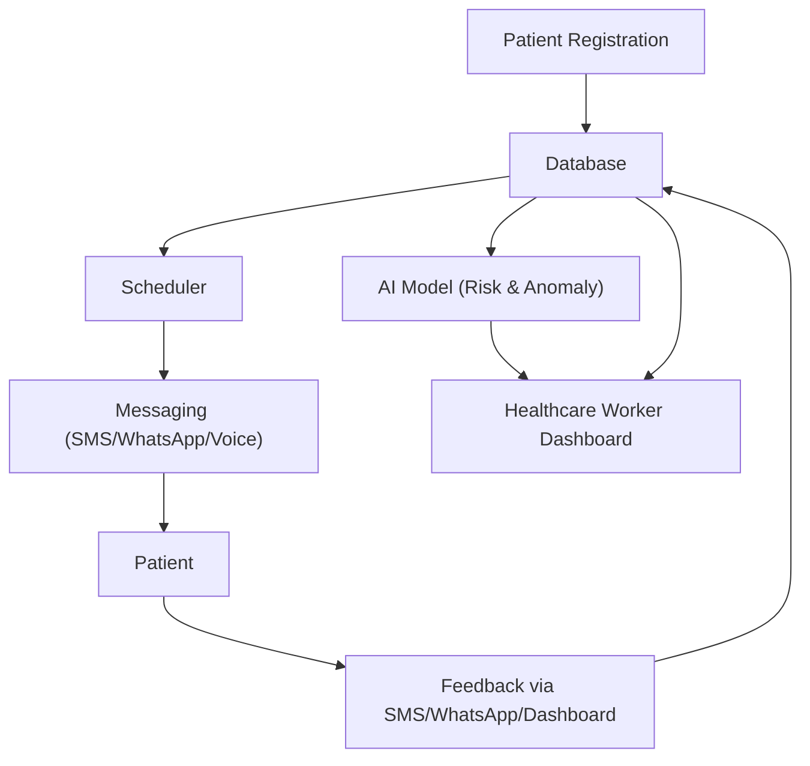

# Tiba Kwa Wakati

A multilingual AI-powered medicine reminder system for East Africa (Kenya, Uganda, Tanzania, Rwanda).

---

## Table of Contents
1. [Overview](#overview)
2. [Why Tiba Kwa Wakati?](#why-tiba-kwa-wakati)
3. [Key Features](#key-features)
4. [Architecture](#architecture)
5. [Visual Architecture Diagram](#visual-architecture-diagram)
6. [Quickstart (Mock Version)](#quickstart-mock-version)
7. [Usage](#usage)
8. [Extending the System](#extending-the-system)
9. [API/Webhook](#apiwebhook)
10. [File Descriptions](#file-descriptions)
11. [Notes](#notes)
12. [Contributing](#contributing)
13. [License](#license)
14. [Contact & Acknowledgments](#contact--acknowledgments)

---

## Overview
Tiba Kwa Wakati is a demo healthcare platform that helps patients remember to take their medication on time, in their preferred language, and enables healthcare workers to monitor adherence. The system uses AI to predict non-adherence risk and supports SMS, WhatsApp, and voice reminders (mocked for demo/testing).

## Why Tiba Kwa Wakati?
- **Addresses medication non-adherence** in East Africa, a major cause of poor health outcomes.
- **Bridges language barriers** with real-time translation and multilingual support.
- **Empowers healthcare workers** with actionable insights and risk alerts.
- **Designed for inclusivity:** works with basic mobile phones and supports multiple languages.

## Key Features
- 🚀 **Patient registration and medication scheduling**
- 🌍 **Multilingual reminders** (SMS, WhatsApp, Voice) [mocked]
- 📝 **Patient feedback logging** (via dashboard or webhook)
- 🤖 **Advanced AI-powered adherence prediction and anomaly detection** (logistic regression with explainability)
- 📊 **Dashboard for healthcare workers** with metrics, trends, and risk explanations
- 📈 **Personalized adherence forecasting** (ARIMA time-series model)
- 🗣️ **Language support:** English, Swahili, Kinyarwanda, Luganda
- 🧠 **Automated sentiment and intent analysis of patient feedback, with flagging of concerning responses**
- 🎯 **Personalized reminder optimization using multi-armed bandit algorithms, adapting timing, channel, and message content for each patient**
- 🚨 **Anomaly & event detection using unsupervised learning (clustering)**
- 🩺 **Predictive analytics for healthcare workers (dropout/complication risk, suggested interventions)**
- ⏰ **AI-driven scheduling recommendations based on patient routines and predicted adherence**

## Architecture
- **Streamlit App (`app.py`)**: Main UI for registration, scheduling, dashboard, and feedback logging.
- **Mock Database (`mock_db.py`)**: In-memory storage for patients, schedules, and feedback.
- **Messaging (`messaging.py`)**: Mocked Twilio integration for SMS, WhatsApp, and voice reminders.
- **Scheduler (`scheduler.py`)**: Periodically checks schedules and sends reminders.
- **Translation (`translate.py`)**: Uses Google Translate API for multilingual support.
- **AI Model (`ml_model.py`)**: Logistic regression for advanced adherence risk scoring and anomaly detection, with feature importance for explainability.
- **Webhook (`webhook.py`)**: Flask endpoint to receive patient feedback via SMS/WhatsApp.

## Visual Architecture Diagram
> **Note:** The following diagram uses Mermaid syntax. If your Markdown viewer does not support Mermaid, use a tool like [Mermaid Live Editor](https://mermaid.live) to view or export as an image.



## Quickstart (Mock Version)
1. **Install requirements:**
   ```bash
   pip install -r requirements.txt
   ```
2. **Run the app:**
   ```bash
   streamlit run app.py
   ```
3. **(Optional) Start the webhook for feedback:**
   ```bash
   python webhook.py
   ```

**Troubleshooting:**
- If you encounter issues with Streamlit or Flask, ensure all dependencies are installed and ports are available.
- For translation, ensure you have internet access (Google Translate API).
- If images or diagrams do not render, check your Markdown viewer’s compatibility.

## Usage
- Register patients and medication schedules via the Streamlit UI.
- Reminders are sent (mocked) at scheduled times in the patient's preferred language.
- Log feedback via the dashboard or by sending 'yes', 'no', 'delay', or open-ended text to the webhook endpoint.
- Healthcare workers can view adherence metrics, risk trends, and feedback logs.
- The system detects anomalies in adherence using clustering.
 - Predicts which patients are at highest risk of dropping out or developing complications, and suggests interventions.
- Recommends optimal medication times for each patient based on their routines and predicted adherence.

**Example: Advanced Adherence Prediction Dashboard Section**

| Feature                | Importance |
|------------------------|------------|
| recent_adherence_rate  | 1.20       |
| num_medications        | 0.85       |
| age                    | 0.60       |
| feedback_count         | 0.40       |

*A bar chart visualizes which factors most influence the risk score for each patient.*

**Example: Personalized Adherence Forecast**

*A line chart shows the predicted probability of adherence for each of the next 7 days, helping healthcare workers anticipate and intervene for at-risk patients.*

**Example: Feedback Analysis Section**

| Feedback Text                                 | Sentiment | Intents        | Flagged |
|-----------------------------------------------|-----------|---------------|---------|
| I felt dizzy and nauseous after taking pills. | negative  | side_effects   | Yes     |
| I forgot to take my medicine yesterday.       | neutral   | forgot         | No      |
| The instructions were confusing.              | negative  | confused       | Yes     |

*Flagged feedback is highlighted for healthcare worker review.*

## Extending the System
- **Production Messaging:** Replace `messaging.py` mocks with real Twilio credentials.
- **Persistent Database:** Swap `mock_db.py` for a real database (e.g., PostgreSQL, MongoDB).
- **Deployment:** Deploy Streamlit and Flask apps to cloud platforms for real-world use.

## API/Webhook
- `POST /feedback` (Flask): Accepts feedback from patients via SMS/WhatsApp. Expects `From` (phone) and `Body` (feedback: 'yes', 'no', 'delay').

## File Descriptions
- `app.py`: Main Streamlit app (UI, registration, dashboard)
- `mock_db.py`: In-memory mock database
- `messaging.py`: Mocked Twilio messaging (SMS, WhatsApp, Voice)
- `scheduler.py`: Reminder scheduling logic
- `translate.py`: Google Translate integration
- `ml_model.py`: Adherence risk and anomaly detection
- `webhook.py`: Flask webhook for patient feedback

## Notes
- Messaging and database are mocked for easy testing.
- Replace `mock_db.py` and `messaging.py` with real integrations as needed.
- For demo only. Not for clinical use.

## Contributing
Contributions are welcome! To contribute:
1. Fork the repository.
2. Create a new branch for your feature or bugfix.
3. Make your changes and add tests if applicable.
4. Submit a pull request with a clear description of your changes.

## License
This project is licensed under the MIT License. See the `LICENSE` file for details.

## Contact & Acknowledgments
- **Project Lead:** Cedrick Shikoli
- **GitHub Repository:** [Tiba Kwa Wakati - Medicine OnTime](https://github.com/ceddyxan/Tiba-Kwa-Wakati-Medicine-OnTime.git)
- **Special thanks** to the open-source community and all contributors. 