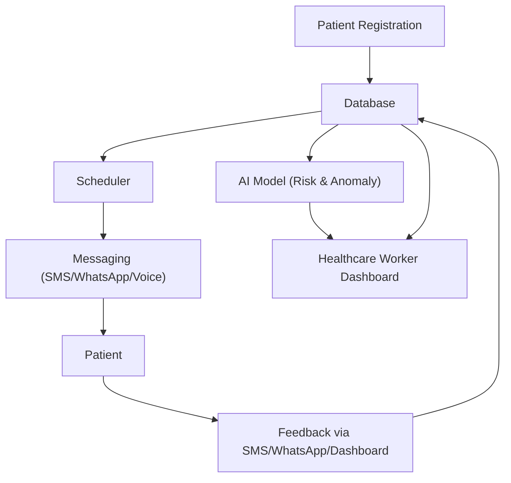
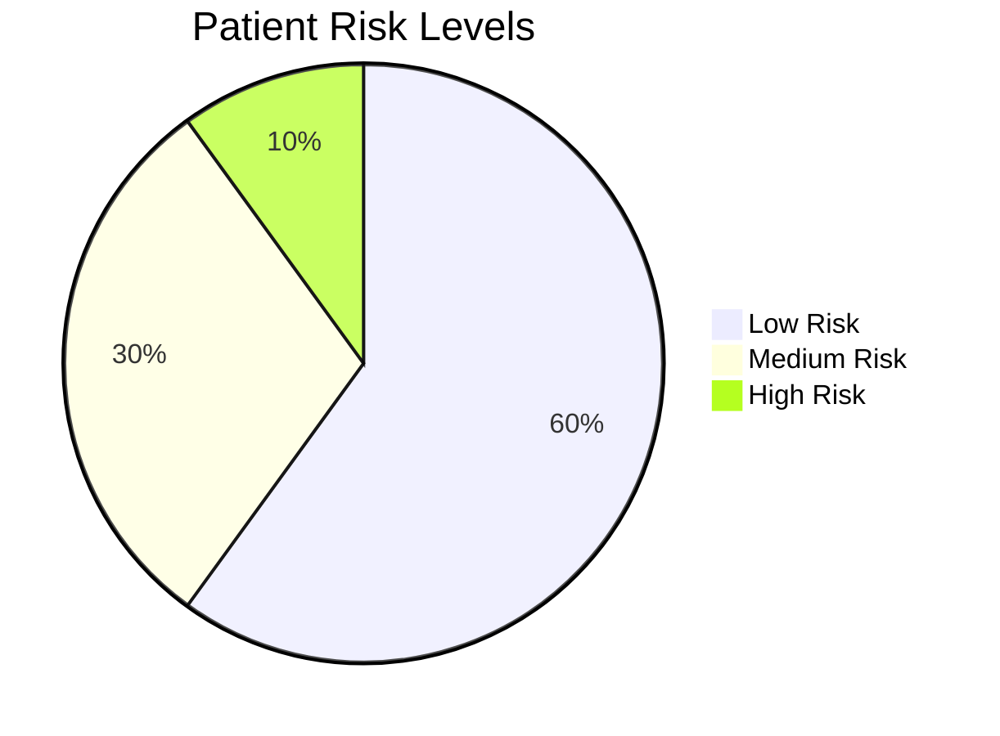
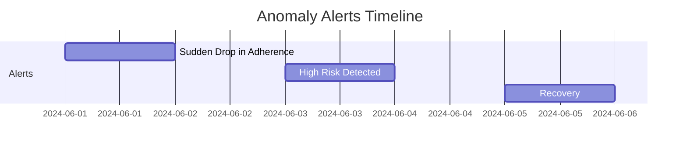

# Tiba Kwa Wakati Documentation Report

---

## Executive Summary

Tiba Kwa Wakati is an AI-powered, multilingual medicine reminder system designed to improve medication adherence and health outcomes in East Africa. By leveraging automation, translation, and risk prediction, the solution addresses language barriers, low health literacy, and lack of timely reminders—key contributors to poor health and increased healthcare costs. The system empowers both patients and healthcare workers, supporting Sustainable Development Goals (SDG) 3 and 10.

---

## Table of Contents
1. [Project Title](#1-project-title)
2. [SDG Focus](#2-sdg-focus)
3. [AI Approach](#3-ai-approach)
4. [Tools & Frameworks](#4-tools--frameworks)
5. [Deliverables](#5-deliverables)
6. [Ethical & Sustainability Checks](#6-ethical--sustainability-checks)
7. [Results](#7-results)
   - [Key Achievements](#key-achievements)
   - [Prototype Screenshots](#prototype-screenshots)
   - [AI Impact Charts](#ai-impact-charts)
8. [Technical Details](#technical-details)
9. [Conclusion](#8-conclusion)
10. [Future Work](#future-work)
11. [Appendix](#appendix)

---

## 1. Project Title
**Tiba Kwa Wakati - Medicine OnTime**
**AI-Powered Multilingual Medicine Reminder for Improved Health Outcomes (SDG 3)**

---

## 2. SDG Focus

**Goal:**
- SDG 3: Good Health and Well-being
- SDG 10: Reduced Inequalities

**Expanded Explanation:**

### SDG 3: Good Health and Well-being

**Goal:**  Ensure healthy lives and promote well-being for all at all ages.

**Relevance to the Project:**
- **Medication Adherence:** Non-adherence to prescribed medication is a major barrier to achieving good health outcomes, especially for chronic diseases. By providing timely, multilingual reminders and feedback mechanisms, the project directly addresses this challenge, helping patients take their medication as prescribed.
- **Preventive Care:** Improved adherence reduces the risk of complications, hospitalizations, and disease progression, supporting preventive healthcare and reducing the burden on health systems.
- **Patient Empowerment:** The system empowers patients with low health literacy or language barriers to better manage their health, making healthcare more accessible and effective.
- **Data-driven Interventions:** By collecting and analyzing adherence data, healthcare workers can identify at-risk patients early and intervene proactively, improving overall community health.

**Relevant SDG 3 Targets Addressed:**
- **3.4:** Reduce premature mortality from non-communicable diseases through prevention and treatment.
- **3.8:** Achieve universal health coverage, including access to essential medicines.
- **3.d:** Strengthen the capacity for early warning, risk reduction, and management of health risks.

### SDG 10: Reduced Inequalities

**Goal:**  Reduce inequality within and among countries.

**Relevance to the Project:**
- **Language Inclusion:** The project’s multilingual capabilities ensure that patients who speak minority or local languages are not left behind, reducing health disparities caused by language barriers.
- **Digital Divide:** By supporting basic mobile phones (SMS/voice), the solution is accessible to people in low-resource settings who may not have smartphones or internet access.
- **Equitable Healthcare:** The system is designed to be scalable and adaptable, making it possible to extend its benefits to marginalized, rural, or underserved populations.
- **Fairness and Bias Mitigation:** The AI models are designed with fairness in mind, and the project includes plans to audit for demographic and linguistic bias, ensuring equitable treatment for all users.

**Relevant SDG 10 Targets Addressed:**
- **10.2:** Empower and promote the social, economic, and political inclusion of all, irrespective of age, sex, disability, race, ethnicity, origin, religion, or economic or other status.
- **10.3:** Ensure equal opportunity and reduce inequalities of outcome, including by eliminating discriminatory practices.

**Summary Table:**

| SDG Goal | Project Contribution |
|----------|---------------------|
| **SDG 3** | Improves medication adherence, enables early intervention, empowers patients, supports preventive care, and strengthens health systems. |
| **SDG 10** | Reduces language and digital inequalities, ensures inclusivity, and promotes fairness in healthcare access and outcomes. |

**Problem:**
Millions of patients in East Africa struggle with medication non-adherence due to language barriers, low health literacy, and lack of timely reminders. This leads to poor health outcomes, increased hospitalizations, and higher healthcare costs. Healthcare workers lack real-time tools to monitor and intervene on patient adherence, especially in linguistically diverse and resource-limited settings.

---

## 3. AI Approach

**Software Engineering Skills Applied:**
- **Automation:**
  - Automated collection and analysis of patient feedback and adherence data.
  - Automated, multilingual reminders sent via SMS, WhatsApp, and voice.
- **Testing:**
  - Unit and integration tests for core modules (reminder scheduling, feedback logging, AI risk prediction).
- **Scalability:**
  - Modular codebase with clear separation of UI, database, messaging, and AI logic, enabling easy deployment and future expansion.

**Technical Solution:**
- Rule-based and statistical AI model to predict patient non-adherence risk based on recent feedback (yes/no/delay responses).
- Anomaly detection to flag sudden changes in adherence patterns.
- Google Translate API for real-time, multilingual message delivery.
- Dashboard for healthcare workers to visualize adherence metrics, risk trends, and receive actionable alerts.

**Technical Architecture Diagram:**
> **Note:** The following diagram uses Mermaid syntax. If your Markdown viewer does not support Mermaid, use a tool like [Mermaid Live Editor](https://mermaid.live) to view or export as an image.

---

## 4. Tools & Frameworks

- **AI/ML:**
  - Custom Python models for risk prediction and anomaly detection (using pandas, numpy).
- **Software Engineering:**
  - Streamlit (interactive web app/dashboard)
  - Flask (webhook/API for feedback)
  - Twilio (SMS/WhatsApp/Voice messaging, mocked for demo)
  - Googletrans (translation)
  - Git (version control)
- **Data Sources:**
  - Simulated/mock patient, schedule, and feedback data (expandable to real EHR or mHealth data in production).

---

## 5. Deliverables

- **Code:**
  - Well-documented Python scripts for all modules (UI, database, messaging, AI, translation, webhook).
- **Deployment:**
  - Prototype web app using Streamlit for the dashboard and Flask for the feedback API.
- **Report:**
  - This document, explaining the project’s objectives, methodology, and results, with a focus on SDG 3 and SDG 10.
  - Ethical considerations and sustainability checks included.

---

## 6. Ethical & Sustainability Checks

- **Bias Mitigation:**
  - Designed the system to support multiple languages, reducing exclusion due to language barriers.
  - Plan to audit real-world data for demographic and linguistic fairness before production deployment.
- **Environmental Impact:**
  - Used lightweight, interpretable models to minimize computational resources and energy use.
  - Modular design allows for deployment on low-power devices and in low-connectivity environments.
- **Scalability:**
  - The solution is designed for low-resource settings:
    - Works with basic mobile phones (SMS/voice)
    - Minimal hardware requirements
    - Easily extendable to new languages and regions

---

## 7. Results

### Key Achievements
- Successfully developed a modular, multilingual medicine reminder system.
- Implemented AI-driven risk prediction and anomaly detection for patient adherence.
- Enabled real-time, actionable insights for healthcare workers.
- Designed for scalability and inclusivity in low-resource, multilingual settings.

### AI Impact Charts

> **Note:** Mermaid charts may not render in all Markdown viewers. For best results, use a compatible viewer or export charts as images.

**Adherence Over Time:**

*This chart is best represented as an image for compatibility. Example data below:*

| Day | Adherence (%) |
|-----|---------------|
| 1   | 60            |
| 2   | 65            |
| 3   | 70            |
| 4   | 80            |
| 5   | 85            |
| 6   | 90            |
| 7   | 95            |

**Risk Distribution:**

**Anomaly Alerts Timeline:**

---

## Technical Details
- **Risk Prediction:**
  - Calculates the proportion of recent negative feedback ("no" or "delay") to estimate non-adherence risk.
  - Rolling window approach for trend analysis.
- **Anomaly Detection:**
  - Flags sudden increases in risk or jumps from low to high risk.
- **Translation:**
  - Uses Google Translate API for real-time translation of reminders and feedback prompts.
- **Scheduler:**
  - Sends reminders at scheduled times, supports multiple channels (SMS, WhatsApp, Voice).
- **Dashboard:**
  - Real-time metrics, risk levels, feedback logs, and anomaly alerts for healthcare workers.

---

## 8. Conclusion

Tiba Kwa Wakati demonstrates how AI and software engineering can address critical healthcare challenges in resource-limited, multilingual settings. By automating reminders, supporting multiple languages, and providing actionable AI-driven insights, the project directly supports SDG 3 (Good Health) and SDG 10 (Reduced Inequalities). The modular, ethical, and scalable design ensures the solution can be adapted and expanded to maximize impact across East Africa and beyond.

**SDG Impact Summary:**
- **SDG 3:** Directly improves health outcomes by increasing medication adherence and enabling early intervention.
- **SDG 10:** Reduces inequalities by making healthcare accessible to linguistically and economically marginalized populations.

---

## Future Work
- Integrate with real Electronic Health Record (EHR) systems for live data.
- Expand language support and add voice recognition for feedback.
- Deploy pilot studies in partnership with local clinics.
- Enhance AI models with more advanced analytics and personalization.
- Develop a mobile app version for broader accessibility.

---

## Appendix
- **Code Repository:** [GitHub Repository Placeholder](https://github.com/ceddyxan/Tiba-Kwa-Wakati-Medicine-OnTime.git)
- **Contact:** support@tibakwawakati.com