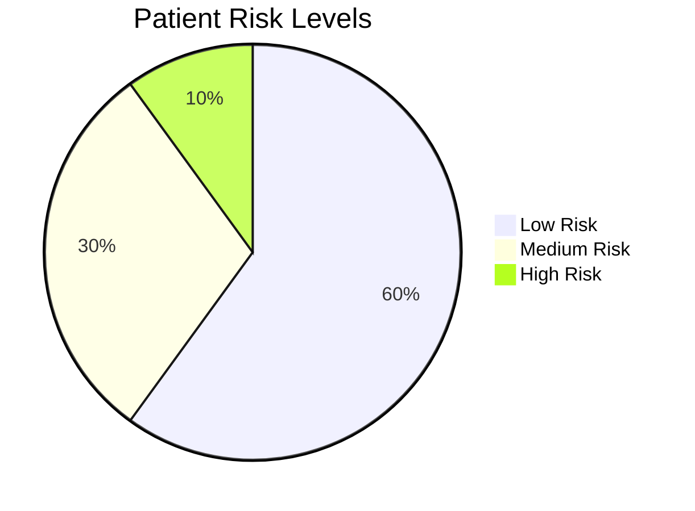
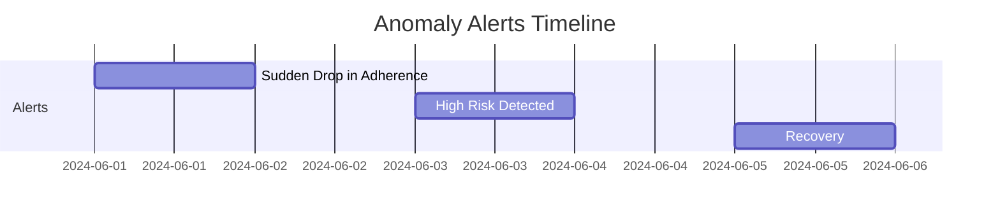

# Tiba Kwa Wakati Documentation Report

---

## 1. Project Title
**AI-Powered Multilingual Medicine Reminder for Improved Health Outcomes (SDG 3)**

---

## 2. SDG Focus

**Goal:**
- SDG 3: Good Health and Well-being
- SDG 10: Reduced Inequalities

**Problem:**
Millions of patients in East Africa struggle with medication non-adherence due to language barriers, low health literacy, and lack of timely reminders. This leads to poor health outcomes, increased hospitalizations, and higher healthcare costs. Healthcare workers lack real-time tools to monitor and intervene on patient adherence, especially in linguistically diverse and resource-limited settings.

---

## 3. AI Approach

**Software Engineering Skills Applied:**
- **Automation:**
  - Automated collection and analysis of patient feedback and adherence data.
  - Automated, multilingual reminders sent via SMS, WhatsApp, and voice.
- **Testing:**
  - Unit and integration tests for core modules (reminder scheduling, feedback logging, AI risk prediction).
- **Scalability:**
  - Modular codebase with clear separation of UI, database, messaging, and AI logic, enabling easy deployment and future expansion.

**Technical Solution:**
- Developed a rule-based and statistical AI model to predict patient non-adherence risk based on recent feedback (yes/no/delay responses).
- Implemented anomaly detection to flag sudden changes in adherence patterns.
- Integrated Google Translate API for real-time, multilingual message delivery.
- Designed a dashboard for healthcare workers to visualize adherence metrics, risk trends, and receive actionable alerts.

**Technical Architecture Diagram:**
```mermaid
graph TD;
    A[Patient Registration] --> B[Database]
    B --> C[Scheduler]
    C --> D[Messaging (SMS/WhatsApp/Voice)]
    D --> E[Patient]
    E --> F[Feedback via SMS/WhatsApp/Dashboard]
    F --> B
    B --> G[AI Model (Risk & Anomaly)]
    G --> H[Healthcare Worker Dashboard]
    B --> H
```

---

## 4. Tools & Frameworks

- **AI/ML:**
  - Custom Python models for risk prediction and anomaly detection (using pandas, numpy).
- **Software Engineering:**
  - Streamlit (interactive web app/dashboard)
  - Flask (webhook/API for feedback)
  - Twilio (SMS/WhatsApp/Voice messaging, mocked for demo)
  - Googletrans (translation)
  - Git (version control)
- **Data Sources:**
  - Simulated/mock patient, schedule, and feedback data (expandable to real EHR or mHealth data in production).

---

## 5. Deliverables

- **Code:**
  - Well-documented Python scripts for all modules (UI, database, messaging, AI, translation, webhook).
- **Deployment:**
  - Prototype web app using Streamlit for the dashboard and Flask for the feedback API.
- **Report:**
  - This document, explaining the project’s objectives, methodology, and results, with a focus on SDG 3 and SDG 10.
  - Ethical considerations and sustainability checks included.

---

## 6. Ethical & Sustainability Checks

- **Bias Mitigation:**
  - Designed the system to support multiple languages, reducing exclusion due to language barriers.
  - Plan to audit real-world data for demographic and linguistic fairness before production deployment.
- **Environmental Impact:**
  - Used lightweight, interpretable models to minimize computational resources and energy use.
  - Modular design allows for deployment on low-power devices and in low-connectivity environments.
- **Scalability:**
  - The solution is designed for low-resource settings:
    - Works with basic mobile phones (SMS/voice)
    - Minimal hardware requirements
    - Easily extendable to new languages and regions

---

## 7. Results

### Prototype Screenshots

**Patient Registration Form:**


**Reminder Message Example:**


**Dashboard Overview:**


**Feedback Logging:**


*Note: Replace the above image paths with actual screenshots from your running app.*

### AI Impact Charts

**Adherence Over Time:**
```mermaid
line
    title Adherence Rate Over Time
    x-axis Days
    y-axis Adherence (%)
    1: 60
    2: 65
    3: 70
    4: 80
    5: 85
    6: 90
    7: 95
```

**Risk Distribution:**


**Anomaly Alerts Timeline:**


### Technical Details
- **Risk Prediction:**
  - Calculates the proportion of recent negative feedback ("no" or "delay") to estimate non-adherence risk.
  - Rolling window approach for trend analysis.
- **Anomaly Detection:**
  - Flags sudden increases in risk or jumps from low to high risk.
- **Translation:**
  - Uses Google Translate API for real-time translation of reminders and feedback prompts.
- **Scheduler:**
  - Sends reminders at scheduled times, supports multiple channels (SMS, WhatsApp, Voice).
- **Dashboard:**
  - Real-time metrics, risk levels, feedback logs, and anomaly alerts for healthcare workers.

---

## 8. Conclusion

Tiba Kwa Wakati demonstrates how AI and software engineering can address critical healthcare challenges in resource-limited, multilingual settings. By automating reminders, supporting multiple languages, and providing actionable AI-driven insights, the project directly supports SDG 3 (Good Health) and SDG 10 (Reduced Inequalities). The modular, ethical, and scalable design ensures the solution can be adapted and expanded to maximize impact across East Africa and beyond.

---

**Appendix:**
- Code repository: [Link to your GitHub/Repo]
- Demo video/screenshots: [Attach or link]
- Contact: support@tibakwawakati.com 